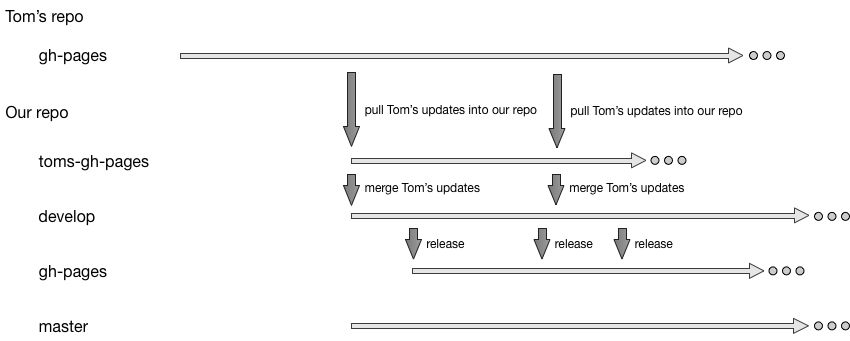

# Our Jekyll-based documentation site

## Branches

This project is based on Tom
Johnson's [`documentation-theme-jekyll`][toms-repo] project.  He has a
simple branching structure in his repository: he has no `master`
branch, seems to work on topic branches that are merged into the
`gh-pages` branch and has a handful of miscellaneous branches hanging
around.

This repository has four long-lived branches (roughly following
the
[gitflow model](http://nvie.com/posts/a-successful-git-branching-model) with
`gh-pages` replacing the usual role of `master` to feed our releases
into GitHub Pages):

- `toms-gh-pages` -- this branch tracks Tom's `gh-pages` branch.
  Tom's `gh-pages` branch should be periodically merged into this
  branch.  No local commits should *ever* be made to this branch.
  `toms-gh-pages` should always be a subset of the `gh-pages` branch
  in Tom's repository.

- `develop` -- this branch holds our ongoing work.  Periodically
  commits from `toms-gh-pages` may be merged into it.  Most new work
  should occur on "topic branches" that originate from `develop` and
  are merged back into it (not shown in the image above).
  Periodically releases are made by merged from `develop` to the
  `gh-pages` branch (which GitHub Pages consumes).

- `gh-pages` -- this branch holds the source for the current release
  of the site.  It should only be updated by merges from the develop
  branch or emergency fixes from hot fix branches.

- `master` -- this branch exists solely for administrative purposes
  such as this README.md.  Eventually we'll have a CONTRIBUTING file
  and various templates here.

[toms-repo]: https://github.com/tomjohnson1492/documentation-theme-jekyll
